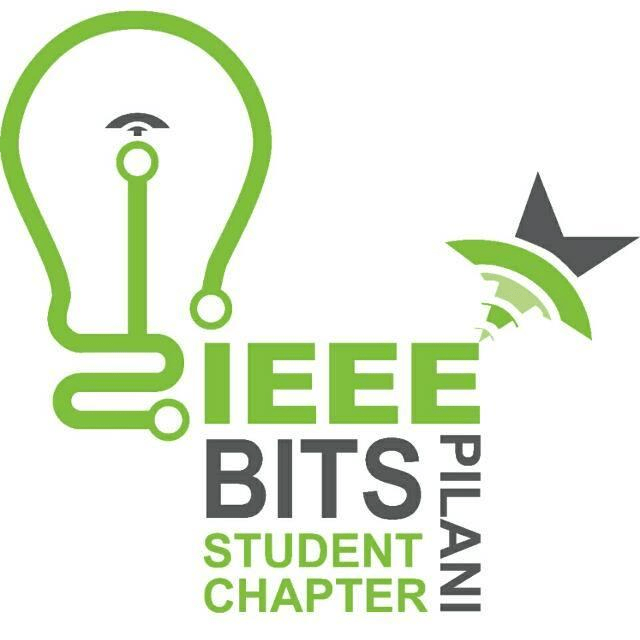

# Apogee 2022 - Micromouse Competition




## Instructions

1) All information can obtained from the [D2C Micromouse Page](https://dare2compete.com/hackathon/micromouse-apogee-bits-pilani-the-encrypted-dimension-birla-institute-of-technology-science-bits-pilani-276091)
2) The participants should clone the repository and set up the simulation on their systems before working on their code.
3) The participants are expected to make changes to the relevant files and submit their work according to the submission guidelines given below. 
4) The participants must not hard code the maze in their code because we would be evaluating the bots on randomized mazes generated by us.
5) The [README file in ieee_micromouse_apogee22](https://github.com/IEEE-BITS-Pilani-Student-Chapter/micromouse22/blob/main/ieee_micromouse_apogee22/README.md) contains all necessary information participants need to complete their work.


## Submission Policy

1)The participants will have to submit the whole ROS application.


2)A single ROS Launch file called final.launch should be present in pkg_ieee_micromouse which should load all the necessary ROS nodes, RViz and Gazebo Simulation to solve theMaze present in arena.world which can be found in the pkg_ieee_micromouse ROS package.


***Note: rviz simulation is for your refrence,even if you can't load rviz simulation you won't be penalized***

3)You can modify the ros package present in the pkg_ieee_micromouse ROS package as per your need.


4)While evaluating your submission we will build your package(s) and launch your final.launch file. So, make sure all the necessary nodes are present in your submission and are launched by the launch file.


5)If you are using third party ROS packages make sure to include that in your ieee-micromouse folder.


6)Before you submit make sure to screen-record your run on your system. Upload this video on google drive and make sure to give prior access.


7)Include a README.md file in your ieee-micromouse folder. This README file should have all the changes you have made e.g. the files you have created. Also include an explanation of the algorithm used.


8)Also record a 'bag file' of the simulation. refer this link for doing the same : [http://wiki.ros.org/rosbag/Tutorials/Recording%20and%20playing%20back%20data]


## Learning resources are provided in ```ROS-Learning-resources.md``` readme file inside the package

## Submission Link - https://forms.gle/F2BaH1Ndx52VkJBE8

***

